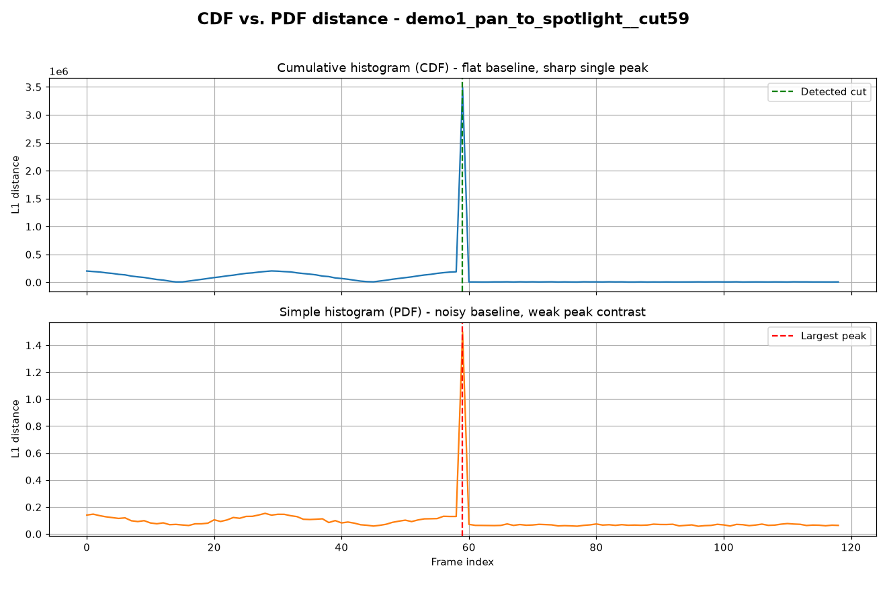
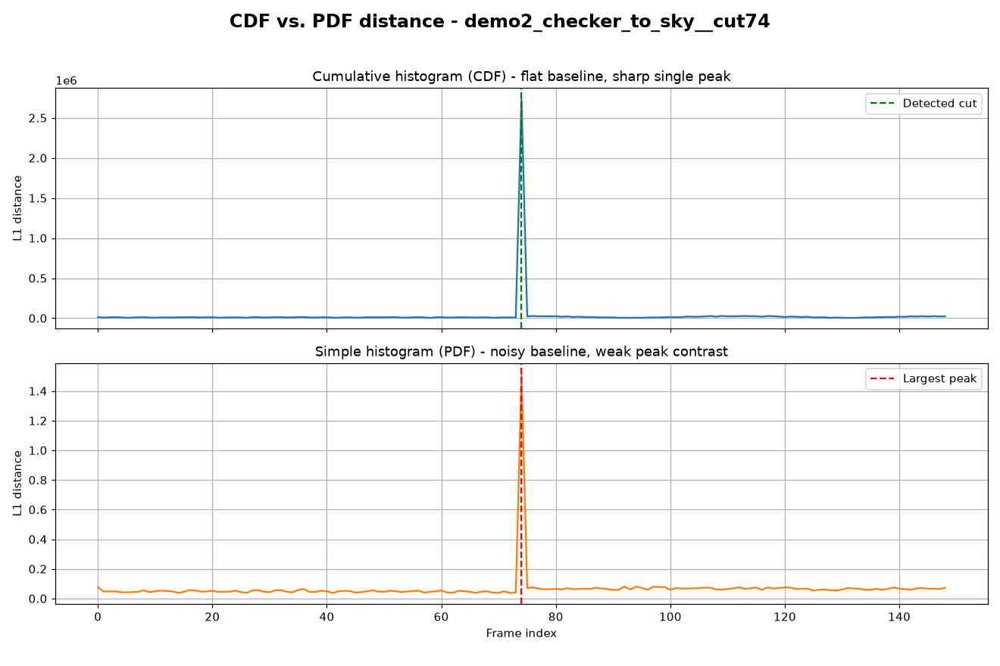

# Scene-Cut Detection with Histogram Distances

Detect hard scene cuts in a video by comparing the grayscale **intensity
histogram** of consecutive frames. The project contrasts two distance measures
and shows why the cumulative one is far more robust.

| Measure | What it compares | Behaviour |
| --- | --- | --- |
| **PDF** | L1 distance between per-bin histograms | Noisy — every bit of motion or noise shuffles mass between bins, so the baseline is high and jittery. |
| **CDF** | L1 distance between *cumulative* histograms (the 1-D Wasserstein distance up to a constant) | Stable — small intensity shifts barely move the CDF, so the curve is flat within a scene and spikes sharply at the real cut. |

The detected cut is simply the consecutive frame pair with the largest **CDF**
distance.

## Results

The demo ships two synthetic clips, each splicing two visually distinct scenes
at a known frame. The detector recovers both ground-truth cuts exactly
(frame 59 and frame 74), and the comparison plots show the CDF's flat baseline /
sharp peak versus the PDF's noisy baseline.

**`demo1` — gradient pan → moving spotlight (cut at frame 59):**



**`demo2` — scrolling checkerboard → bright sky (cut at frame 74):**



`demo2` is the clearest illustration: the scrolling checkerboard constantly
swaps pixels between the dark and bright bins, so the **PDF** baseline stays high
throughout the first scene, while the **CDF** ignores it and only reacts at the
true cut.

## Method

For each pair of consecutive frames:

1. Convert RGB to grayscale with Rec. 601 luma weights.
2. Compute a 256-bin intensity histogram in `[0, 1]`.
3. **PDF distance:** L1 distance between the normalised histograms.
4. **CDF distance:** cumulative-sum each histogram, then take the L1 distance.
5. The frame index that maximises the CDF distance is the cut.

## Usage

```bash
pip install -r requirements.txt          # numpy, matplotlib, mediapy (needs ffmpeg)

python generate_demo_videos.py           # (re)create the demo clips in videos/
python scene_cut_detection.py videos/*.mp4 --plots --out results
```

Run it on your own footage:

```bash
python scene_cut_detection.py path/to/clip.mp4
# clip: scene cut between frame 128 and 129
```

Or use it as a library:

```python
from scene_cut_detection import detect_scene_cut, histogram_distances

last_of_scene1, first_of_scene2 = detect_scene_cut("clip.mp4")
cdf_distances, pdf_distances = histogram_distances("clip.mp4")
```

## Layout

```
scene_cut_detection.py   detector + plotting + CLI
generate_demo_videos.py  synthetic test-clip generator
videos/                  generated demo clips (cut frame encoded in filename)
results/                 generated distance / comparison plots
```

## Note

This started as a university computer-vision assignment. The histogram
detection logic is my own; the original course test videos have been replaced
with the self-contained synthetic clips in `generate_demo_videos.py` so the
project runs end-to-end without any course material.
